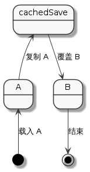

# GameData 接口设计 与 实现方案选型

本篇文档说明两个问题：

1. GameData 接口是怎么设计的
1. GameData 内部是怎么实现的

---

<!-- TOC depthFrom:2 -->

- [1. 接口](#1-接口)
    - [1.1. 如何使用接口](#11-如何使用接口)
    - [1.2. 接口返回的对象中不包含与其他实体的联系](#12-接口返回的对象中不包含与其他实体的联系)
- [2. 实现](#2-实现)
    - [2.1. Singleton](#21-singleton)
    - [2.2. 使用『文件+JSON』而不是『数据库+SQL』](#22-使用『文件json』而不是『数据库sql』)
    - [2.3. 选用 nolmann::json 操作 JSON 文件](#23-选用-nolmannjson-操作-json-文件)
    - [2.4. JSON 文件组织](#24-json-文件组织)
    - [2.5. GameData 的工作流程](#25-gamedata-的工作流程)
    - [2.6. 如何保证『在玩 A 存档时，能保存到 B 存档上』](#26-如何保证『在玩-a-存档时能保存到-b-存档上』)
- [3. 后续数据如何添加到 GameData 中](#3-后续数据如何添加到-gamedata-中)

<!-- /TOC -->

---

## 1. 接口

### 1.1. 如何使用接口

GameData 的接口包括两部分：

1. 在 GameData.h 中定义的 GameData 类成员函数
1. 在 GameData 文件夹下定义的各 struct

游戏逻辑调用 GameData 函数，GameData 函数返回对象，游戏逻辑再去使用返回的对象。这就是 GameData 接口的使用方式。

### 1.2. 接口返回的对象中不包含与其他实体的联系

一个实体可能会与多个实体相联系，比如说一个角色可以装备多个道具，可以装备多个符卡，

1. 是将这些关系直接放入实体做成 `vector<tag>`，
1. 还是说实体就是实体，不包含与其他实体之间联系（即不包含那些 vector<tag>），想知道哪些实体与此实体联系时，再去问 GameData 呢？

我们选用了后者，接口返回的对象中不包含实体之间的关系。这么做是因为：我们想让实体类的定义更小，简单明了，一眼就能看懂这个实体是什么，不用费劲心思去理解实体定义中定义的那些 vector<tag>，思考与其他实体之间的联系。在真正需要处理这个实体与其他实体之间联系的时候，再去看 GameData 的接口，了解所需要的那一部分联系。

## 2. 实现

### 2.1. Singleton

做成单例保证游戏运行期间只有一个 GameData 对象，防止多对象同时操作造成混乱。

### 2.2. 使用『文件+JSON』而不是『数据库+SQL』

现在几乎所有的应用程序的存储方案用的都是数据库，但我们的游戏使用 JSON 文件：

1. 开发效率：游戏中的数据天生是『树』形，JSON 天生也是『树』形，直接映射操作更方便

    - 一个存档下有若干个可操纵的人物，有若干个已经解锁的地点，有若干个已经获得的装备，有若干个已经获得的符卡
        - 每个人物有可装备若干个道具，可装备若干个的符卡
    - 一个地点下有若干个关卡，有若干个对话

    如果用数据库来存储，理论上每个一对多的关系都要都建一张表。以上那么多一对多的关系，再算上我们没提到的关系，我们要建的表的数量可能会达到 20+ 个，表数量的增多会在一定程度上增加维护和操作的成本。就算在实践中我们使用一些特殊方法将一些表各并，使表的数量减少了，但这同时会使得数据的操作会变得很不直观，难以理解，以后可能不会再有人能维护这个数据库了。为了这么小的数据库使用这种特殊方法得不偿失。

    如果用 JSON，那我们可以直接将这些树形的数据直接组织成一颗树，GameData 操作这棵树来读取和改动存档，比数据库操作要更简单明了。

1. 运行效率：JSON 内存型 DOM 效率 >> 文件型数据库效率

    - 使用 JSON 时，JSON 引擎会将整个文件全部读入内存，做成内存 DOM 树，带来附加的效率提升。

所以从开发效率，和运行效率两方面考虑，我们选择『文件 + JSON』。

### 2.3. 选用 nolmann::json 操作 JSON 文件

要操作 JSON 文件，就需要一个 JSON 引擎。[nlomann::json](https://github.com/nlohmann/json) 有 STL-like 的操作接口。函数的命名和迭代器的使用方式都和 STL 一致，能够快速上手，而不用再去查它的手册。这是我们选用它的理由。

### 2.4. JSON 文件组织

```
file:Resources/gamedata
|-- awards.json
|-- characters.json
|-- conversations.json
|-- items.json
|-- locations.json
|-- saves.json
`-- spell_cards.json
```

其中除 saves.json 是存档数据外，其他 json 文件都是只读的设定数据。

以下对 saves.json 的内部做一些解释：

1. **saves.json 中有一些非存档性的玩家设置数据**

    像背景音乐音量大小，音效音量大小，对话速度大小，这些非存档性的设置数据也一并放入 saves.json 中了。这并没有什么特别的原因，只是因为这些数据量很少，就直接放在这里了。

1. **saves.json 包含所有的存档，一个存档在其中是一个子节点**

    由于『概念设计图』限制了游戏存档只能有 4 个，数量不是很大。所以所有的存档都放入 saves.json 文件中了，这样可以减少操纵多文件问题。

1. **saves.json 中有一个 tag 为 0 的存档模板**

    tag 为 0 的存档作为新建存档的模板，是一个实现上的东西，不算做玩家的实际存档。当玩家需要新建存档时，以其作为模板生成一个编号不为 0 的模板。

1. **saves.json 中只存档设定数据（道具，符卡，地点）的编号**

### 2.5. GameData 的工作流程

1. 将存档文件和设定文件解析成 DOM 树（init）
1. 若 GameData 正处于开发阶段，则做一些开发阶段的测试和特殊初始化工作（inDevelop）
1. 游戏逻辑使用 GameData 的接口，GameData 代为操作 DOM 树，这时对存档所做的更改不实时同步到文件中（各个接口）
1. 若游戏逻辑明确表示要存档，GameData 将 DOM 树上做的更改同步至文件中（*Save 接口）

### 2.6. 如何保证『在玩 A 存档时，能保存到 B 存档上』

游戏要支持在『在玩 A 存档时，能保存到 B 存档上』必须要有一些特殊措施来保证。为了简单，我们采用缓存更改的方式。

如下图所示：



将所做的更改不直接做在 A 上，而做在 cachedSave 上，当想保存到 B 时就用 cachedSave 覆盖 B，这样 A 就不会被更改了。

## 3. 后续数据如何添加到 GameData 中

如 2.3 节所述，存档数据在 saves.json 中，设定数据在其他 json 文件中。

1. 若要更改存档模板就更改 saves.json 中 tag 为 0 的存档
1. 若要添加设定数据就更改其他 json
