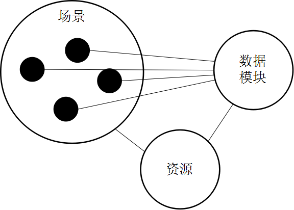
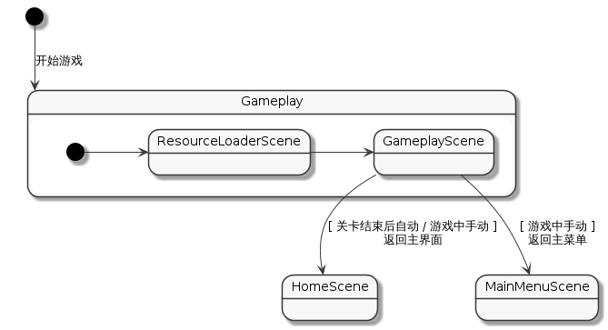
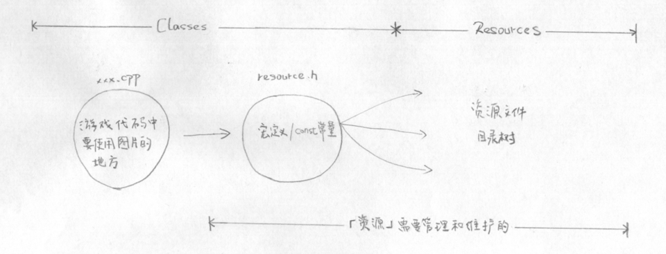

# 总体实现方案

注意：本文档中所提到的 `场景`，均指实现上的概念，对应实际的 `cocos2d::Scene`；『概念设计图』的一个个方框在本文档中称为 `界面`。多个 `界面` 可能被放置到一个 `场景` 中实现。

---

<!-- TOC depthFrom:2 -->

- [1. 关于本文档](#1-关于本文档)
- [2. Android 版本与分辨率适配](#2-android-版本与分辨率适配)
    - [2.1. 版本适配](#21-版本适配)
    - [2.2. 物理分辨率适配](#22-物理分辨率适配)
- [3. 数据模块](#3-数据模块)
    - [3.1. 数据分类](#31-数据分类)
    - [3.2. 数据模块接口对象 GameData](#32-数据模块接口对象-gamedata)
    - [3.3. GameData 对应特定存档](#33-gamedata-对应特定存档)
    - [3.4. 使用注意](#34-使用注意)
- [4. 从数据角度看游戏过程](#4-从数据角度看游戏过程)
- [5. 场景划分](#5-场景划分)
- [6. Non-Gameplay 场景](#6-non-gameplay-场景)
    - [6.1. 一些特殊 Scene/Layer 的说明](#61-一些特殊-scenelayer-的说明)
        - [6.1.1. SaveScene](#611-savescene)
        - [6.1.2. MainMenuScene 和 HomeScene 的 SettingsLayer](#612-mainmenuscene-和-homescene-的-settingslayer)
        - [6.1.3. 很多场景都用到的 ConversationLayer](#613-很多场景都用到的-conversationlayer)
    - [6.2. 场景切换与生存周期](#62-场景切换与生存周期)
        - [6.2.1. 从哪进入就返回到哪](#621-从哪进入就返回到哪)
        - [6.2.2. 要怎么实现长生存周期？](#622-要怎么实现长生存周期)
        - [6.2.3. 由长生存周期而带来的问题及其解决方案](#623-由长生存周期而带来的问题及其解决方案)
- [7. Gameplay 场景](#7-gameplay-场景)
    - [7.1. ResourcesLoaderScene](#71-resourcesloaderscene)
    - [7.2. GameplayScene](#72-gameplayscene)
        - [7.2.1. 制作和创建地图](#721-制作和创建地图)
        - [7.2.2. 获取地图元素](#722-获取地图元素)
        - [7.2.3. 制作阻挡区域](#723-制作阻挡区域)
        - [7.2.4. 视角跟随](#724-视角跟随)
        - [7.2.5. 一切都纳入事件机制](#725-一切都纳入事件机制)
        - [7.2.6. 实现特殊触屏操作](#726-实现特殊触屏操作)
        - [7.2.7. 使用物理引擎进行碰撞判定与处理](#727-使用物理引擎进行碰撞判定与处理)
        - [7.2.8. 发射器](#728-发射器)
        - [7.2.9. 弹幕](#729-弹幕)
        - [7.2.10. 操控](#7210-操控)
        - [7.2.11. 动画](#7211-动画)
        - [7.2.12. 接触回调函数，监听器和调度器](#7212-接触回调函数监听器和调度器)
        - [7.2.13. 敌人](#7213-敌人)
        - [7.2.14. BOSS](#7214-boss)
- [8. 资源的使用](#8-资源的使用)
    - [8.1. resources.h](#81-resourcesh)
- [9. 开发脚手架](#9-开发脚手架)
    - [9.1. Non-Gameplay 场景的跳转表](#91-non-gameplay-场景的跳转表)
    - [9.2. Gameplay 场景的 MockListener](#92-gameplay-场景的-mocklistener)
    - [9.3. resources.h.dir](#93-resourceshdir)
    - [9.4. 内有文字的矩形/圆 PlaceHolder](#94-内有文字的矩形圆-placeholder)

<!-- /TOC -->

---

## 1. 关于本文档

场景，数据和资源三者之间需要相互协调。



作为『总体实现方案』，本文会从贴近实现的角度上讨论场景，数据，资源三者：

1. 之间的接口风格
1. 各自的功能职责和特征行为
1. 各自的体系结构
1. 各自的核心工作机制和工作流程
1. 各自的实现注意事项和建议

如果一个模块内部的设计和实现需要更为细致的讨论的话，会有专门的『xxx设计与实现方案』文档。

同时，总体实现方案要照顾到从『设计』到『开发』，到『测试』，到『部署』的所有环节。因此本文：

1. 在实际讨论上面所说的游戏三大模块之前，还会对 Android 的版本与分辨率适配方案进行讨论
1. 在讨论三大模块时也会讨论三大模块在 Debug 和 Release 不同生成方案下的不同行为
1. 在讨论完三大模块的实现方案之后还会讨论在开发中会用到的一些辅助开发的措施

## 2. Android 版本与分辨率适配

### 2.1. 版本适配

| | |
| --- | --- |
| SDK 最低版本 | API 19（Android 4.4） |
| SDK 目标版本 | API 23（Android 6.0） |
| SDK 编译版本 | API 23（Adnroid 6.0） |

版本会在 `AndroidManifest.xml`（还有其他地方？） 中直接指定，编程时无需显式指定也无需担心。

### 2.2. 物理分辨率适配

| | |
| --- | --- |
| 设计分辨率 | 1280x720 |
| 缩放策略 | FIXED_HEIGHT |
| 适配的物理分辨率范围 | [720p, 2k] |
| 主要适配的物理分辨率 | 1080p，720p |

在编程时要先用 `auto visibleSize = Director::getInstace()->getVisibleSize()` 得到 visibleSize, 然后根据这个 visibleSize 对界面元素进行**相对布局**。（为了效率考虑，可以在类内部缓存得到 visibleSize。）

欲在屏幕右上角放置一个元素，

正确示例：

```
node.setPosition(Vec2(visibleSize.width - 100, visibleSize.height - 100));
```

错误示例：

```
node.setPosition(Vec2(1180,620));
```

## 3. 数据模块

### 3.1. 数据分类

在实际讨论数据处理之前，我们先对游戏中要用到的非实现相关的数据分一下类：

| 类别 | 运行时是否改变 | 包含的数据 |
| --- | --- | --- |
| 设定数据 | 否 | 对话，道具效果等这些设定 |
| 存档 | 是 | 各个相互独立，且可自由切换的存档 |
| 运行时不需要在场景间共享的数据 | 是 | 场景自己的 |

### 3.2. 数据模块接口对象 GameData

为方便管理存档数据和设定数据，我们将数据从游戏逻辑中抽取出来，做成一个独立的数据模块。这个数据模块向游戏逻辑隐藏存档与设定数据的具体存储细节，并提供接口对象 GameData（singleton）供游戏逻辑使用。

GameData 中总共有两种类型的数据：设定数据，存档。但对游戏逻辑来说，它不需要分清 GameData 里面哪些是设定数据，哪些是存档；GameData 对象里面的就仅仅是数据而已，需要什么就读取什么，想改什么就改什么。


### 3.3. GameData 对应特定存档

GameData 在同一时间对应且仅对应一个存档。外部逻辑访问 GameData 时不需要显式地给出存档编号，所有的操作都默认作用在一个特定的存档上。当需要操作另一个存档时，需要使用 `GameData->getInstance()->switchSave(saveTag)` 将 GameData 对应的存档换掉，自此以后所有的操作都会默认作用到 `saveTag` 存档上。

由于只有固定个数的存档，`saveTag` 为 int 格式，1 就表示 1 号存档，2 就标示 2 号存档，以此类推。

### 3.4. 使用注意

1. **不要缓存从 GameData 得到的数据**。

    1. 原因一：可能会失效。可能会每一次对 GameData 对象的访问（接口调用）都可能使『上一次 GameData 访问所得到的数据』失效。
    1. 原因二：没有必要。为了效率考虑，GameData 会将数据与存档文件全部读入内存中，对于计算量较大的数据也可能会内部缓存。访问 GameData 时并没有明显的效率损失。

## 4. 从数据角度看游戏过程


## 5. 场景划分

我们将游戏中的所有场景大致分为两类：

- Non-Gameplay 场景。指道具库，主界面，设置，存档界面等那些『非玩家操作人物实际冒险』的场景。
- Gameplay 场景。指『玩家操作人物实际冒险』的场景。


这么分类的原因主要是：

- 这两类场景实现方式明显不同，运行机制明显不同。一个是简单的 MenuLayer，一个是地形，敌人，弹幕，物理引擎，用户操作等组件之间的事件检测、分发、处理。
- 不同类的场景之间相互切换时有不同的方案。当然了，这是为了性能而必需付出的代价。

场景具体划分方案、实现方案、场景间切换方案见后续章节。

## 6. Non-Gameplay 场景

场景自上而下进行，深颜色表示的是关键路径，浅颜色表示的是可选路径（图）。

注意：『概念设计图』中的多个界面（设计上的概念）可能仅对应下图中一个场景（实现上的概念），一个场景若包含了多个界面，会在图中说明。


### 6.1. 一些特殊 Scene/Layer 的说明

本节会深入一些特殊的 Non-Gameplay 场景内部。

注：没有在本节提到的 Non-Gameplay 场景一般逻辑都非常简单，大多数都只是『Menu + 一些回调函数』，实现时自行按照『概念演示图』所示界面做即可。

#### 6.1.1. SaveScene

可以从两个地方进入 `SaveScene`，两种地方进入 `SaveScene` 它所要执行的动作不同：

1. 从 `MainMenuScene` 进入，做『读取存档』动作
1. 从各场景的 `SettingsLayer` 进入，做『保存存档』动作

为实现这一点：

1. 在创建 `SaveScene` 时，即指定是执行『读取』还是『保存』动作： `SaveScene::create(boolean isSaveAction)`。

#### 6.1.2. MainMenuScene 和 HomeScene 的 SettingsLayer

从不同场景进入设置界面时，设置界面有不同的可设置项。为实现这一点：

1. 给每个 Scene/Layer 增加数据成员 `static const std::string TAG = "SceneName/LayerName"`，用来标识 Scene/Layer 自己。
1. 在创建 SettingsLayer 时即指定创建者 `SettingsLayer::create(const std::string& sceneTag)`。SettingsLayer 内部可以根据这个传入的 sceneTag 来决定自己行为。

#### 6.1.3. 很多场景都用到的 ConversationLayer

很多场景中都可能使用对话。而且根据游戏进度，对话可能发生也可能不发生（由各场景自己处理）。为了更灵活的使用，我们将对话做成 Layer: ConversationLayer。

ConversationLayer 可能会在一个场景中多次使用，所以不在创建时指定所有信息。而使用特定的接口，传递特定的参数来设置对话背景/对话人物/对话内容。

### 6.2. 场景切换与生存周期

Non-Gameplay 场景的生存周期拟定为 [第一次创建此场景, 进入 Gameplay 场景)。

我们靠控制场景切换时的行为来控制场景的生存周期：

| 场景切换双方 | 是否保留被替换掉的场景 | 为什么 |
| --- | --- | --- |
| Non-Gameplay -> Non-Gameplay | 是 | 用户第二次进入此场景时，可以加快速度 |
| Non-Gameplay -> Gameplay | 否，而且删除所有 Non-Gameplay 场景缓存 | 为 Gameplay 场景让出内存 |
| Gameplay -> Non-Gameplay | N/A | 待后续章节介绍|

#### 6.2.1. 从哪进入就返回到哪

『概念设计图』中提到，从哪个场景进入就返回哪个场景。为实现这个特性，我们需要保存场景间的切换先后关系 —— 使用 cocos2d::Director 维护的场景栈。

如果将 Non-Gameplay 场景中的所有场景及其间跳转关系看成一棵树，使用场景栈的规则是：

- 从父节点到子节点，压栈
- 从子节点返回父节点，退栈

#### 6.2.2. 要怎么实现长生存周期？

- 不使用场景栈：最简单的实现方案是使用 Director 维护的场景栈来保存被替换掉的场景。但我们并不能保证场景与场景之间的切换关系能形成有向无环图（尽管现在是）。

- 不做成 singleton：对 singleton 机制稍加改变，『给每个场景加上 `destorySelfIfexists()` 方法，在进入 Gameplay 场景时依次调用各场景的这个方法来销毁它们自己』这个方法听起来也不错。但这种没有作成缓存对象方便，尤其是在场景数量可能变化时。

- 使用自定义的缓存对象： 做一个缓存对象（singleton）：NonGameplayScenesCache，其内维护一个 Map\<std::string, Scene*\>，不用的场景保存进去，用的场景再读出来。

    1. 给每个 Scene 增加数据成员 `static std::string TAG = "SceneName"`，用来标识 Scene 自己。
    1. 自定义 Scene::create()：在 create 函数中以 TAG 作为键值查询 NonGameplayScenes 缓存查找自己，找到了则返回；否则：
        1. new 自己
        1. init 自己
        1. 将自己加入 nonGameplayScenes 缓存


**注**：模仿 `cocos2d::CREATE_FUNC`，我们在 `TouhouGame.h` 中定义了一个宏 `APP_SCENE_CREATE_FUNC`。在实现场景时可以直接使用这个宏来展开能使用缓存的 `create()` 函数。

#### 6.2.3. 由长生存周期而带来的问题及其解决方案

1. 场景切换时，场景展示内容要变化
    如『概念设计图』所述，同一场景切换回来时可能会它的界面会变化（比如在 MapSelectScene 中更换了地图之后再返回 HomeScene，HomeScene 的背景图就要变化）。可以在 `Scene::onEnter()` 这个函数成员中处理这个变化，这样 cocos2d-x 引擎可以自动在切入这个场景时调用（像 Android 一样）。

## 7. Gameplay 场景

Gameplay 共有两个场景，一个 `ResourcesLoaderScene` 负责加载资源，一个 `GameplayScene` 负责运行游戏。



按照『概念设计图』所述，在 Gameplay 场景中有且仅有『返回主菜单』和『返回主界面』两种方式退出 Gameplay 场景，分别返回到 `MainMenuScene` 和 `HomeScene`。返回到 Non-Gameplay 场景之后的行为同 Non-Gameplay 对应章节介绍。

### 7.1. ResourcesLoaderScene

ResourcesLoaderScene 要完成以下任务：

1. 创建 `GameplayScene` 及其 UI 树
1. 初始化 `GameplayScene` 内数据
1. 加载所有 `GameplayScene` 要用到所有纹理资源/地图资源
1. 创建并注册所有 `GameplayScene` 运行时要使用的 Listener
1. 资源加载完成时进入 `GameplayScene` ，并销毁自己（利用 cocos2d-x 自带的内存管理机制）

为使 ResourcesLoaderScene 加载资源时界面不失去响应，可以使用多线程技术同时进行『资源加载』和『加载界面显示』。若由于某些原因，无法使用多线程简单的解决问题，可以做 workaround：将任务分割到不同的帧上，每一帧完成一部分任务。

cocos2dx 提供的有异步加载和显示的相关解决方案。

### 7.2. GameplayScene

GameplayScene 创建时指定了创建一个物理世界，这样添加在这个场景中的层中的元素才可以使用物理系统。

GameplayScene 的 UI 树组织如下：

分这么多层的初衷是尽量减少各种界面元素间的依赖关系，每个层次能够专注于自己本身功能的实现与维护，也利于简单地实现界面元素间的优先关系。但是层次过多又会增加层次之间的通信开销。

至少有两个层是必不可少的。
- 控制层负责接受玩家的所有操作，以及显示出必备的界面元素，例如按键和血条等。
- 场景层承载游戏中的元素，例如背景，地图，敌人，玩家，子弹，特效等等。

这两个层次都可以进一步的细化，例如控制层可以单独地把显示角色状态的血条拆出来当作HUD层，场景层可以单独把背景拆出来做背景层。


#### 7.2.1. 制作和创建地图

使用可视化的工具制作瓦片地图。瓦片地图中至少存在两类图层。图块层和对象层。这两类层的概念仅仅存在于TMX地图文件中，在编写代码时不需要管这些层的关系。两类层的数量并没有什么限制。

- 图块层只负责显示，并没有什么特别的逻辑关系。即使在画布上画了一大块地板或障碍物，但是没有指定任何游戏逻辑，则这些图块顾名思义，仅仅就是图片而已。一般制作地图时会创建至少两个图块层，一个用来绘制地形图块，另一个用来绘制装饰物。
- 对象层给地图添加游戏逻辑相关的内容，制作地图时，对象层就是一个个游戏中不可见的形状而已。可以为每个形状设置其特有的属性值，游戏代码根据这些属性值来判断这个形状具体代表什么意义，例如可以支撑玩家的地板，怪物的刷新点，玩家的出生点，道具的摆放位置等。可以有很多个对象层，多分对象层有利于管理。

瓦片地图的实质就是一个XML文件，所以在代码中可以访问到其中的内容，主要是对象层的内容，图块层的内容也是可以获取到的。cocos2dx封装的`TMXTiledMap`类提供了方便的接口，用于便捷地获取指定的对象层或图块层的内容，可以将指定的内容转换成一个包含丰富信息的对象并返回。

在代码中创建地图时，返回的并不是一个层，而是一个继承自Node类的一个`TMXTiledMap`对象，需要再将这个对象添加到一个层中，之后的编码中也不需要特意区分这个层和这个地图对象，大部分情况下可以就把这个层当作地图。当然也可以直接添加到场景中，但是我不建议这么做。

#### 7.2.2. 获取地图元素

创建地图不仅仅只是将地图加载进游戏里，同时要检查地图中对象层中的元素，并按照这些对象的属性判断应该进行执行什么样的游戏逻辑。在加载完毕地图后，通常会保留一下地图对象的指针，便于之后对地图的操作。

使用如下代码获取地图中的某个对象层中的所有对象，例如获取`physics`层中的对象。
```
TMXObjectGroup* group = _map->getObjectGroup("physics");

auto objects = group->getObjects();

auto ts = group->getObject("birthPoint");
```
objects是一个`cocos2dx::ValueVector`类的对象，所以之后在代码中就可以当作普通的容器一样遍历里面的对象。也可以直接获取层中的某一个对象，只需要指定一个名字就行。这些对象的类型都是`cocos2dx::ValueMap`，所以需要用键值对的方式操作这些对象。

某些情况下，你可能需要在控制台输出获取到的容器中的对象的内容，可以使用如下代码。
```
Value objectsVal = Value(objects);
log("%s", objectsVal.getDescription().c_str());
```

#### 7.2.3. 制作阻挡区域

地图中会有许多玩家不可以穿越的区域，例如地面，墙壁等，统称阻挡区域。

实现阻挡的方式有很多，一种比较老的做法是每一帧都判断角色四周的一些特定的点，根据这些点的坐标取到地图元素中的图块，判断图块的属性，如果这个图块的属性是不可穿越，则停止角色的动作，就像真的踩在地面上或者撞到了墙。这种方式其实就是一种不用物理引擎，手动实现的一种碰撞检测机制。理解起来不难，但是编码的时候很繁杂，而且很不灵活，例如这种检测方式遇到圆形和斜坡地形就很头痛。

可以充分利用物理引擎，在地图上制作一些不可穿越的，透明的静态刚体。这些刚体完全不受任何外界影响，就静静地出现在我们在地图中为它们规划好的区域。

制作地图时最好单独分出来一个对象层`physics`，这个层专门用来绘制阻挡区域，里面的对象指定了地图中的阻挡区域。cocos2dx封装的物理引擎，支持的形状有矩形，多边形，折线，圆形，但不支持椭圆。所以在制作地图时，只使用前四种图形绘制对象层中的对象。利用这些形状可以绘制更复杂的地形。我们随时可以在代码中操作这些刚体，例如可以随时移除一个静态刚体，达到地面塌陷的效果。

在代码中读取`physics`层中对象的形状，其实就是读取这个对象的所有顶点的坐标，创建一个`cocos2dx::PhysicsShape`，然后将这个形状绑定给一个`cocos2dx::PhysicsBody`，给这个刚体设置静态属性，最后将这个刚体绑定给一个`cocos2dx::Sprite`并`addChild`，这个阻挡区域就出现在了游戏中。

一个刚体不管是静态的还是动态的，可以由很多的形状组成。一个Node只可以绑定一个刚体。在创建这些阻挡区域时，为了以后能更灵活地处理这些阻挡区域，每一个对象都绑定一个单独的精灵，而不用几个形状连起来赋给一个刚体。

#### 7.2.4. 视角跟随

当刚体被创建完毕后，所有的刚体就和TMX地图牢牢绑定在一起了。可以想象整个地图就是一个巨大的画面，但是玩家看到的屏幕只是显示这个巨大画面的一个部分而已。视角跟随就是使玩家移动的时候同步移动屏幕。

实现视角跟随有很多方法。以前较常用的一种是采用相对运动的原理，玩家的可视区域固定，移动背后的地图。这种做法不太适合含有大量物理模拟的游戏，因为移动背后的地图的时候，还需要同步的移动地图中的刚体，他们相对于整个OPENGL的绘制坐标已经发生了改变。实现起来比较麻烦。

cocos2dx提供了一个继承自`Action`的`Follow`类，可以非常容易地实现可视区域的自动跟随。创建跟随类的同时要指定跟随的元素，以及跟随的区域。跟随的元素就是玩家的精灵，区域就是整个地图的宽和高。指定跟随的元素要在同一个层中，即在地图层中。这个跟随类实质是一个Action，执行这个Action的是承载游戏地图的那个“层”。当指定元素在层中的位置改变时，玩家的视角会自动跟随，但是整个地图层相对于绘制坐标系的位置没有改变，所以也不需要移动刚体。然而这个`Follow`类会将所追踪的Node元素至于屏幕的正中间，在很多情况下，无关紧要的空白地形区域会占据至少五分之二的界面，影响观感。

可以引入一个`摄像机`节点，整个视角跟随的是摄像机的位置，而不是玩家的位置。我们需要做的就是根据玩家的位置更新摄像机的位置即可。摄像机可以放在角色的右上方位置，这样可以展示更多的右部区域。对摄像机位置的更新也很有讲究，例如如果角色快速下降，摄像机应该能够转移到角色下方，好让玩家观察到地图下方的内容。

#### 7.2.5. 一切都纳入事件机制


使用事件机制后，我们的代码明显分成了四部分：

1. 场景承载（场景元素的组织与承载，UI 树）
1. 场景元素自行动（敌人的自动行走，攻击）
1. 事件判定（用户按下了前进键，打死了一个敌人，捡了一个物品 ...）
1. 事件处理（用户按下前进键要发生什么，打死一个敌人后要发生什么，捡了一个物品后要发生什么 ...）

其中由于 3 事件判定需要 1 场景层所承载元素的各种信息，为了方便，我们将它们写到一起。用户操纵和释放技能的做成 `CtrlPanelLayer`、`SpellCardAndItemLayer`，地图和敌人行动的做成 `BattleLandLayer`。

为了将各种事件的处理逻辑从代码层面上分离，方便不同的人同时工作，每类事件的 Listener 我们都做成一个从 `EventListenerCustom` 派生的类 `Listener*`。它提供 `static EventListenerCustom* createAndRegister(const std::string& eventName, Node* bindNode = nullptr) ` 方法来创建并注册自己。

相比于函数直接调用，事件分发机制明显比较复杂。但事件分发机制将一个事件的『判定过程』和『处理过程』进行了很好的分离。这个特性使得我们可以很容易地 a) 做测试 b) 不同人同时开发同一模块。（具体见『开发脚手架』一节）

#### 7.2.6. 实现特殊触屏操作

cocos2dx只提供了四种触摸操作的事件监听器，没有提供双击，长按等操作的监听器，只能自己来编写。

处理双击事件，设置一个`bool`类型的标记`clicked`，初始值为`false`。注册`onTouchBegin`监听器，使用`if-else`语句，点击时判断`clicked`，如果是`false`，则在处理监听时间的代码中设置一个调度器，延迟0.3秒后执行，同时将`clicked`设置为`true`，而这个调度器用来将`clicked`重新设置为`false`。如果在调度器里面的代码执行前再次点击，将会在调用一次onTouchBegin的处理代码，此时`clicked`是`true`，还没来得及被设置为`false`，此时就可以执行双击事件的处理代码了。

长按事件分两种，一种是按下后不会立即执行，而是按键结束后才执行，通常用来做一些“蓄力”相关的事件。这种比较好实现，判断一下开始和结束的时间就好。第二种是按下后立即执行，直到按键结束。在按下的时候开启调度器，这个调度器每一帧都执行，用来处理长按的游戏逻辑，例如角色移动，每一帧都给角色一定的加速度。当按下结束后，在`onTouchEnded`中将调度器`unschedule`。

#### 7.2.7. 使用物理引擎进行碰撞判定与处理

使用物理引擎进行碰撞检测和处理的关键是正确地设置三种掩码。刚体和形状都可以被设置掩码，但一般给刚体设置一下掩码就可以了。

- 种别掩码categoryBitmask，默认值为0xFFFFFFFF；
- 接触掩码contackBitmask,默认值为0x0;
- 碰撞掩码collisionBitmask,默认值为0xFFFFFFFF;

每次两个刚体接触时，物理引擎会拿各自的`种别掩码`和对方`接触掩码`进行`逻辑AND`操作，结果为`true`的话就会执行`接触回调`。在接触中每对刚体只执行一次碰撞检测，所以只需要一方的接触条件成立即可。接触掩码默认值为0，所以默认不会进行接触回调。

当两物体接触的时候一般都会发生碰撞，但是这个碰撞是否进行还需要进行检测。将`种别掩码`和对方的`碰撞掩码`进行`逻辑AND`操作，返回`true`才进行物理模拟。与接触不同的是，两个刚体碰撞可能只有一个会发生物理模拟，而另一个没有反应，所以每一个需要发生物理模拟的刚体都必须正确地设置`碰撞掩码`。

可以创建一个`EventListenerPhysicsContact`监听器，并注册一组接触回掉函数控制接触和碰撞的全过程。在这里有个很绕的坑。如果一开始你什么掩码也不设置，接触掩码默认为0，碰撞掩码默认为0xFFFFFFFF。你可能会以为要进行碰撞检测，必须经过接触检测onContactBegin。然而默认情况下不会进行接触回调，那么就不会有这个物理模拟发生。然而默认情况下几乎每个刚体都会进行默认的碰撞的物理模拟。

默认情况下，物理模拟是一定进行的，接触判断发生在物理模拟之前，用于决定是否放弃进行物理模拟。这几个接触回掉函数是给开发者的一个接口，便于开发者精确控制两个物体间的碰撞的行为，开发者可以主动控制碰撞的各个阶段，来实现一些可能是物理引擎之外的，和游戏逻辑相关的操作。

如果你不写这几个回调函数，那么就是简单地按照前面说的用掩码来判断，来进行默认的碰撞模拟，不会触发接触回调。如果你写了这么几个回掉函数，并且成功添加监听器，但是你只是简单地返回true或者false，如果设置的合适，那么效果和用默认的物理模拟没什么不同。所以注册这几个回掉函数的主要目的就是能够实现一下游戏逻辑相关的操作。

在设计碰撞掩码的时候有个很巧的办法，只需要给每个刚体设置一个种别掩码就好。设计接触掩码的时候，只需要对需要接触的刚体的种别掩码取或（`|`）即可。看如下代码：

```
static const int groundCategory = 0x1 << 1;
static const int playerCategory = 0x1 << 2;
static const int bulletCategory = 0x1 << 3;
static const int enemyCategory  = 0x1 << 4;

groundBody->setCategoryBitmask(groundCategory);
groundBody->setCollisionBitmask(playerCategory|enemyCategory);
//groundBody->setContactTestBitmask(0);	
```
在这个代码中，对地面的掩码进行了设置。碰撞掩码里写了敌人掩码和玩家掩码，这样地面只会和玩家以及敌人产生碰撞，而子弹会直接穿过地面。没有设置接触掩码，所以不会进行接触回调。

// TODO 碰撞判定表

碰撞判定表暂时不需要，目前只需要正确设置种别掩码即可。

#### 7.2.8. 发射器

这一节的内容为下一部分的内容做铺垫。

所谓发射器就是发射`子弹`的一个`Node`而已。发射器的任务就是创建精灵，并且给刚创建的精灵设置初始的运动方向，初始运动速度，以及发射后的运动轨迹。每一个发射出去子弹都应该加到一个子弹容器里，这样就可以方便地取到发射出去的子弹，并加以控制。创建子弹精灵的同时要创建一个刚体，并且和精灵绑定，用于进行碰撞检测。让创建的子弹运动起来，可以使用`Action`类，使用moveTo，或者moveBy等各种动作；也可以使用物理引擎，给精灵绑定的刚体设置`速率`或者`冲量`等物理属性。

由于发射的子弹很多，游戏需要连续地读取子弹的图片文件，发射子弹的系统算是影响性能的大头。一个有效的老办法是，把这些经常创建的图片缓存起来。可以创建一个SpriteBatchNode类的对象来缓存子弹的图片，以后每次创建子弹，都直接从这个缓存中创建一个副本即可。

```
SpriteBatchNode* bulletBatchNode = SpriteBatchNode::create("bullet.png");
auto bulletSprite = Sprite::createWithTexture(bulletBatchNode->getTexture());
```
但是cocos2dx 3.0之后采用了全新的绘制系统，能够实现`自动批绘制`。所谓`自动批绘制`就是底层可以对等待绘制到屏幕上的元素进行简单的检查与排序，如果使用同样的纹理的话就可以自动成批的绘制。新的绘制系统将优化从逻辑层面移到了底层实现，所以减轻了程序员的工作量。底层已经帮我们做了很多，我们不用太担心绘制的性能问题。唯一的问题可能是我们对底层的实现机制不是特别了解，如果最后真的因为弄巧成拙出现性能问题，改成老办法也很简单。

子弹并不会一直飞下去，每种子弹都有自己的最大飞行距离或者最大飞行时间，到达期限后子弹应该自己销毁自己。给子弹创建一个`sequence`，里面是按顺序执行的各种`回掉函数`或者`Action`，他们用来控制子弹的行动顺序，并在最后添加一个销毁自身的回掉函数即可。

#### 7.2.9. 弹幕

// TODO by 朱宏伟

#### 7.2.10. 操控

玩家操控的角色需要符合一定的物理规律，就是速度是逐渐加快的，而停止移动后还应该有微小的惯性，所以最好使用物理引擎来控制角色移动。需要给玩家的刚体设置好质量，密度，回复力，摩擦力，以及禁止旋转等许许多多的物理属性，这些只能通过不断的微调来改善。

实现角色的跳跃很简单，只需要给角色一个向上的冲量。如果需要改变左右移动的速度，就需要引入加速度的概念，通过前面所讲的长按回调事件，每一帧都给角色一个冲量。当水平速度达到设定的最大值时就停止加速。这样其实不是很严谨，因为如果角色受到外力被弹飞，也会被这个设置的最大水平速率给限制。这就需要再增加更多的判断条件，引入很多的标志位来判断。
下面的代码每帧执行，判断当前的水平速率和最大速率，并设置冲量，实现平缓加速移动的效果。

```
if (velocity.x < MAX_SPEED) {
		impluse.x = std::min(MAX_SPEED / ACCELERATE_TIME * dt, MAX_SPEED - velocity.x);
	}
```
角色不能无限制地在空中跳跃，所以需要引入一个跳跃次数的变量，每一次连续跳跃都要修改这个变量，一旦次数为0就禁止跳跃。直到玩家和地面接触，调用接触地面的回掉函数，在回掉函数中复位角色的各种状态，例如恢复可跳跃次数。

可能有一些操作需要判断角色是否在空中还是站在地面上，就要再引入两个bool变量，isLand，isAir。每次接触地面，都将isLand设置为true，将isAir设置为false。跳跃的时候反之。这样就可以再游戏中精确地了解到角色到底是在空中还是在地面。

#### 7.2.11. 动画

角色在不同的状态下应该播放不同的序列帧动画。实际上就是切换角色上显示的动画。在创建角色之前要先创建很多不同的动画，例如角色向右走的动画，角色向上跳跃的动画，角色放符卡的动画。

可以为每一种动画设置一个标志位，在一个每帧都执行的`schedule`中根据角色当前的运动状态，切换角色应该执行的动画。角色的标志位除了正在执行的动作，还应该有角色面朝的方向，这样才可以正确处理角色的转向。

也可以将这些动画切换的操作放在各个接受操作的回掉函数中，例如如果点击了跳跃，那么就在跳跃的回掉函数中设置切换动画。但是如果跳跃之后就不操作了，还是需要根据角色之后的状态重新设置动画，或者在与地面的接触回掉函数中设置动画。这样做虽然好理解，还不需要加标志位，但是切换动画的操作很分散，代码不容易维护。

总之需要对角色设置很多很多的标志位，需要对角色的行为进行很多的抽象，提取出很多的标记信息，这些设计可以慢慢来。

#### 7.2.12. 接触回调函数，监听器和调度器

当接触发生后，可以在onContactBegin监听器中注册处理接触的回掉函数，在这个回掉函数中，处理接触事件。接触函数的命名不需要一定是onContactBegin，但是同一个监听器只能注册一个接触回调函数，用onContactBegin作为回掉函数的名称就好。
```
auto contactListener = EventListenerPhysicsContact::create();
contactListener->onContactBegin = CC_CALLBACK_1(Enemy::onContactBegin, this);
```

在接触回掉函数执行的时候，无法直接获取到发生接触的双方信息。只能获得发生碰撞的两个形状，ShapeA和ShapeB，如果需要知道哪一方是ShapeA，并且获取到对应的`Node`，使用如下的方法。

```
auto nodeA = contact.getShapeA()->getBody()->getNode();
auto nodeB = contact.getShapeB()->getBody()->getNode();
```
在这个Enemy类的接触回掉函数中，需要判断这些node的Tag。假设子弹的tag是102，那么可以用如下的方法进行判断。在回掉函数的代码中尽量不要使用`this`，总会带来莫名其妙的问题。

```
if (nodeA->getTag() == 102)
		{
			nodeA->removeFromParentAndCleanup(true);//移除子弹

			auto enemy = (Enemy*)nodeB; //需要类型转换
			enemy->hp = enemy->hp - 5;
			if (enemy->hp < 0)
			{
				nodeB->removeFromParentAndCleanup(true);
			}
		}
		else if (nodeB->getTag() == 102)
		{
			nodeB->removeFromParentAndCleanup(true);//移除子弹
			auto enemy = (Enemy*)nodeA;
			enemy->hp = enemy->hp - 5;
			if (enemy->hp < 0)
			{
				nodeA->removeFromParentAndCleanup(true);
			}
		}
```

编写代码的时候，经常会使用`this`指代本类的对象。例如在playerRunRight中，大量使用了this来获取对象的各种属性。下面的代码为player类的实例对象_player启动一个调度器，每帧执行回掉函数playerRunRight。

例如在GameScene类中，如果启动调度器的时候使用的是下面的代码，那么就会出现运行异常。

```
this->schedule(CC_SCHEDULE_SELECTOR(Player::playerRunRight));//错误示例
```

```
_player->schedule(CC_SCHEDULE_SELECTOR(Player::playerRunRight));//正确示例
```

上面的this指代的只是这个GameScene的对象，在执行回掉函数的时候，会自动把启动调度器的对象的指针传给回调函数。但是上面的错误示例传了一个场景的指针给Player类中的函数，程序当然会抛出运行时异常。仔细想一想，只是启动了调度器，而且基本没有给什么参数，人家函数没办法知道到底要操纵的对象是哪个，只能是谁启动调度器就找谁。当然不是说用this总是会出错，如果只执行同一个类中的回掉函数，这样写也没什么问题。但是为了避免不必要的麻烦，`启动调度器的时候尽量不要使用this`，应该直接使用启动调度器的对象指针，更加直观。

监听器使用很方便，从每一个Node都可以获得EventDispatcher，可以直接注册监听器。但是一般来说，还是规范一下，统一从导演类的单例对象获取事件分发器。下面的两种代码都可以使用。

```
this->getEventDispatcher()->addEventListenerWithSceneGraphPriority(contactListener, this);

auto dispatcher = Director::getInstance()->getEventDispatcher();
dispatcher->addEventListenerWithSceneGraphPriority(contactListener, this);
```

如果回掉函数写在其他的类中，应该这样写：

```
auto enemy = Enemy::create();
auto contactListener = EventListenerPhysicsContact::create();
contactListener->onContactBegin = CC_CALLBACK_1(Enemy::onContactBegin, enemy);
contactListener->onContactSeparate = CC_CALLBACK_1(Enemy::onContactSeparate, enemy);
dispatcher->addEventListenerWithSceneGraphPriority(contactListener, this);
```

#### 7.2.13. 敌人

敌人和玩家遵循大致相同的一套规则。基本上角色有什么属性，状态和标志，敌人也会拥有。玩家移动需要逐渐加速，敌人也是。最大的区别是敌人是`自主行动`的，也就是说敌人是有智能的。

往高大上的方向来说这叫`人工智能`，叫`AI`。虽然目前只能实现`人工智障`。

一个`优秀`的横板过关游戏的AI，应该有下面的几个`基本`特性：

1. 自主移动，AI应该能够判断角色的位置，改变自身的移动方向和面朝方向。
1. 障碍检测，AI能够通过一些低矮的障碍物并接近玩家，并且主动避免接触有害的陷阱等不利因素。
1. 感知能力，AI不应该对无法“看到”的事物做出反应，所以AI需要有决定自身行动的一组策略和判断依据。
1. 攻击能力，AI能够依据玩家的情况采取不同的攻击策略。
1. 随机行动，AI的行动应该是不可以预知的。

第1条，AI每帧获取到角色的当前位置，计算自身和玩家的距离。AI接近玩家的目的一般都是为了攻击，那么如果还没有到达攻击范围，那么AI就每帧获得一定的加速度，类似玩家移动一样接近玩家。

第2条，AI以自身为中心向四周发射几条长度和角度固定的`物理射线`，物理引擎提供的射线功能可以方便地获得射线接触到的事物的距离，以此判断高台是否能够跳上去，小型的坑是否能够跳跃过去，以及前方是否有陷阱等等。这些射线就是AI的`眼睛`，射线接触到的事物就是眼睛关注的`焦点`，长度和角度是看到的`范围`。

第3条，AI具有威胁检测和状态转换机制。威胁检测可以是一个矩形框，主要用来判断是否有玩家出现在框内，也可以是一个不断扫描的射线。平时敌人处在闲逛状态，一旦检测到敌人，就切换到另一种激进状态，开始进行攻击和主动接近的动作，此时再设置一个追踪框，一旦玩家脱离了追踪范围，那么敌人就放弃攻击，转为闲逛状态。一般来说，AI是不需要躲避玩家的攻击的。

第4条，主要是针对BOSS级别的敌人，应该能够根据自身的状态，玩家的状态综合判断，决定最合适的攻击方式，一般来说就是决定应该发射什么样的弹幕。对于一般的敌人，就是判断自身的攻击是否能够击中玩家。

第5条，AI的实现离不开各种各样随机数，所以在进行各种各样的行动之前，应该先设置好各种行动的权重，AI应该更倾向于使用权重更大的行动，但不排除会突然放个必杀技什么的......

一个敌人不需要一定具备上述所有特性，实际上，很多类似游戏中的AI往往也只是具备一两个特性，甚至完全就是个只会向前跑的智障，就是当一个挡枪的炮灰。

平时看起来人工智能很高大上，其实也就是那回事，核心就是判断判断再判断。一个很好的经验就是把自己当作AI，面对各种各样的情形，你会怎么做，做这些事需要什么条件或者信息。设计出来一个聪明的AI也只是个时间问题。

#### 7.2.14. BOSS

等待弹幕系统就绪。

// TODO by 张晨

## 8. 资源的使用

Resources 文件夹下的所有东西统称为『资源』。这一节会说明如何在游戏代码中使用资源 --- 使用『资源』向游戏代码提供的隐藏掉其自身物理组织的接口: `resources.h`。

『资源』的物理组织，即『哪些文件应该放入哪些文件夹』，这些问题不在本节讨论范围。

### 8.1. resources.h

有两个原因，我们不使用像 `images/logo.png` 这样的实际路径：

1. 资源的物理组织方案尚未完成。现在还没有决定如何组织资源，哪些文件应该放入哪些文件夹，应该以怎样的层级组织资源。如果现在实现时就硬编码到程序里面了，以后资源的物理组织方案决定以后，还要更改游戏代码所有用到资源的地方。
1. 实际路径会使得游戏代码依赖于资源的实现。如果资源文件后来变更了位置，还要手动更改游戏代码中所有使用该资源文件的地方。

所有要使用资源的游戏模块都要 `include "resources.h"` 并使用其中定义的宏 / const 常量来访问资源。



resources.h 内容由『资源』管理和维护，由实现『资源』物理组织的人管理和维护。

## 9. 开发脚手架

至此，我们的『数据实现方案』、『场景实现方案』、『资源使用方案』都已经介绍完了。但这样是没办法直接动工的，各场景/模块之间有很强的依赖关系，若没有一些辅助性组件，我们只能等到一个模块开发完成之后才能去开发另一个模块。

### 9.1. Non-Gameplay 场景的跳转表

Non-Gameplay 场景之间的数据依赖通过引入 GameData 已经解决了。但控制流是自上而下的，不同人开发不同场景时势必要根据自己的场景重定向控制流以便于测试，而这种控制流的重定向在代码层面是很难合并到一起。

所以，在 `LogoAndDisclaimerScene` 下面（`LogoAndDisclaimerScene` 要负责数据模块的加载，我们不能跳过它）我们额外增加一个场景 `JumpTableScene`，统一地来做控制流重定向，只要在 `JumpTableScene` 里面点击相应的按钮就可以跳转到相应场景。


这样，就可以继续进行开发了。不过还有一个问题，其他场景没有完成的时候，跳转到其他场景的代码可能无法正常运行，甚至编译都无法通过。

所以，场景的内部实现时，跳转到其他场景的代码先写好并注释掉。等所有人都写完所有场景了，再进行合并，将控制流改回来。

### 9.2. Gameplay 场景的 MockListener

`MockListener` 是日志型的 Listener，由 `ResourcesLoaderScene` 负责创建和注册，用于辅助『判定』代码。它接收所有自定义类型的事件，每接收一个事件便向 Console 打一条 log。判定代码可以根据打的 log 来判断自己何时发出了事件，并根据这个发出时间调整自己的判定条件。

当真实的 Listener 写好之后，只需要将真实的 Listener 注册到 `EentDispatcher`，Listener 即可正常工作；『判定』代码和其他代码不需要做任何改动。

### 9.3. resources.h.dir

游戏最终完成之前，谁也不知道最终要用到多少资源（图片/音乐），资源文件以及 `resources.h` 需要在开发时动态变化。然而开发过程中若每个人都根据自己的需要去改动 `resources.h` 这一个文件，由于版本控制软件的限制，不同人的改动很可能会造成冲突。若处理不得当则可能会影响他人的工作。

所以，为了避免多人对同一个文件进行编辑：

1. 我们引入 `resources.h.dir`。每个场景在这个目录下都有一个对应的头文件（命名可以使用场景名的一部分，只要不与其他场景的头文件名一样就行），头文件中定义了这个场景要用到的所有资源，图片资源定义以 `IMG_XXX_` （XXX 为场景名或部分场景名）开头，声音资源定义以 `SND_XXX_` 开头
1. 在 `Resources` 目录下每个场景对应一个子目录，存放这个场景要用到的资源

比如：

LogoAndDisclaimerScene 用到的资源文件在 `Resources/logo` 中，资源定义头文件为 `resources.h.dir/logo.h`，其中图片定义以 `IMG_LOGO_` 开头，音乐定义以 `SND_LOGO_` 开头。

**最终合并**:

按照『资源的使用』一节所说，所有的资源定义最终要合并到一个头文件 `resources.h` 中，所有的资源最终会进行重组织。

如果我们以后真的需要进行合并工作，只需要：

1. 将 `resources.h.dir` 下所有头文件合并为一个头文件，并根据资源文件的物理组织改变每个定义的值
1. 将每个 cpp 文件包含的头文件由 `resources.h.dir/xxx.h` 改为 `resources.h`

### 9.4. 内有文字的矩形/圆 PlaceHolder

如果你喜欢快速原型，那么本节是为你准备的。

// TODO 示意图

矩形/圆内有文字，可设置背景颜色，文字颜色，矩形/圆大小。
