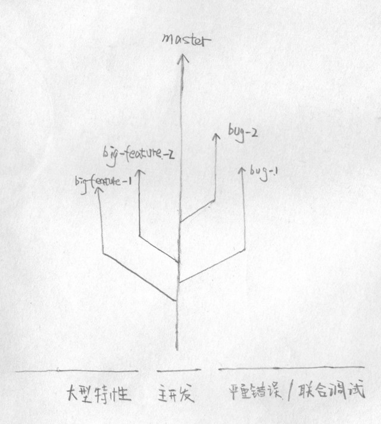

# Git 协作指南 | 开发工作流

本文描述使用 Git 进行小组内文档、代码协作的工作流，以及在工作流中需要遵守的各项规范。但并不提及 Git 的使用原理，在提及 Git 相关命令时也不再对其进行详细介绍。在阅读本文档前，请确保你已经阅读过 [廖雪峰的 Git 教程](http://www.liaoxuefeng.com/wiki/0013739516305929606dd18361248578c67b8067c8c017b000)。

---

<!-- TOC depthFrom:2 -->

- [1. 搭建本地协作环境](#1-搭建本地协作环境)
    - [1.1. 注册 GitHub 帐号](#11-注册-github-帐号)
    - [1.2. 安装和配置本地 Git 客户端](#12-安装和配置本地-git-客户端)
    - [1.3. 安装 clang-format plugin for Visual Studio](#13-安装-clang-format-plugin-for-visual-studio)
- [2. 都有哪些东西放入 Github 仓库](#2-都有哪些东西放入-github-仓库)
    - [2.1. 关于构建系统配置文件](#21-关于构建系统配置文件)
    - [2.2. 关于 Resources](#22-关于-resources)
- [3. 仓库中都有哪些分支](#3-仓库中都有哪些分支)
    - [3.1. 日常开发 master --- 单分支、减少 Git 的使用负担](#31-日常开发-master-----单分支减少-git-的使用负担)
    - [3.2. Bug 联调、特性测试 --- 另开分支、做好隔离](#32-bug-联调特性测试-----另开分支做好隔离)
- [4. 克隆仓库到本地](#4-克隆仓库到本地)
- [5. 在本地工作](#5-在本地工作)
- [6. commit 并 push 到 Github 上](#6-commit-并-push-到-github-上)
    - [6.1. commit/push 前注意](#61-commitpush-前注意)
    - [6.2. commit msg 书写规范](#62-commit-msg-书写规范)
    - [6.3. commit/push 方式](#63-commitpush-方式)
- [7. 待确定问题](#7-待确定问题)
- [8. 如果你遇到问题](#8-如果你遇到问题)

<!-- /TOC -->

---

本次『工程设计与管理』中，我们使用 Git 来进行小组内文档和代码协作，使用 clang-format 来统一代码风格。

## 1. 搭建本地协作环境

### 1.1. 注册 GitHub 帐号

1. 在 [GitHub](www.github.com) 上注册帐号，注意：

    使用英文 username。如果没有，现在选择一个。

1. 在注册完成并验证邮箱后，完善 GitHub 个人资料。

    在 Settings > Profile > Public profile 下填写 Name 一项后点击 `Update profie` 。开发过程中不要再更改此 Name。

### 1.2. 安装和配置本地 Git 客户端

1. 从 [git 官网](https://git-scm.com/) 上下载 Git for Windows，并以默认选项安装。
1. 熟悉 Git Bash。Git for Windows 自带 `Git Bash` `Git CMD` `Git GUI` 三种用户界面。在本次工程设计中，我们只使用 `Git Bash`。在实际进行 Git 相关操作以前，熟悉 `Git Bash` 并调整的字体大小以及默认窗口大小满意自己喜好。
1. 生成 SSH Key 并添加到自己的 GitHub 帐号中，具体的步骤参见 [廖雪峰的 Git 教程/远程仓库](http://www.liaoxuefeng.com/wiki/0013739516305929606dd18361248578c67b8067c8c017b000/001374385852170d9c7adf13c30429b9660d0eb689dd43a000)。
1. 使用 VS Code 新建文件 `C:\Users\<your-win-username>\.gitconfig`，并填入如下内容（请一字不差的复制，我没有理由害你）：

    在 `name` 一项后面写上你在 Settings > Profile > Public Profile 中填写的 Name，在 `email` 一项后面写上注册 GitHub 时候使用的邮箱。

```
[user]
    name =
    email =
[core]
    editor = code --wait # 使用 vs code 来编辑 commit message。如果没有 vs code，建议装一个
    safecrlf = true # 防止 crlf/lf 混用
    quotepath = false # 防止中文路径乱码
[alias]
    lg = log --color --graph --pretty=format:'%Cred%h%Creset -%C(yellow)%d%Creset %s %Cgreen(%cr) %C(bold blue)<%an>%Creset' --abbrev-commit
```

### 1.3. 安装 clang-format plugin for Visual Studio

大括号换行的和大括号不换行的打起来怎么办？ (´_ゝ｀)

为了避免上面这种情况，我们使用统一的代码风格。[clang-format](https://clang.llvm.org/docs/ClangFormat.html) 可以跨平台使用，可以集成到各种 IDE 里面，而且使用纯文本形式的代码风格描述方式（.clang-format）。我们将使用这个工具来统一代码风格。

1. 打开网址 [LLVM Snapshot Builds](http://llvm.org/builds/)，点击页面最后一个链接，下载 ClangFormat-r298093.vsix
1. 点击下载好的文件，直接安装。安装好之后应该能在 VS > Tools 菜单内见到相应按钮，点击 2 号按钮即可对当前文件中的代码进行格式化。

`.clang-format` 届时会直接放在代码库里。

## 2. 都有哪些东西放入 Github 仓库

简单的来说，cocos2d-x 能自动生成而且不需要人工干预或者更改的都不放入 Git 仓库。

具体哪些文件放入版本控制系统，参见代码库下 .gitignore 文件。

### 2.1. 关于构建系统配置文件

1. **proj.win32/sln,vcxproj** 是 VS 构建项目的文件。但由于组里面没有人了解 VS vcxproj/sln 的详细使用规则，为防止不同人的不同版本之间造成冲突，此文件暂不放入版本控制系统。

    在第一次将代码拉到本地时，需要 xxxxx

    // TODO by 张晨

1. **/CMakeLists.txt** CMakelists.txt 是 CMake 编译项目必需的文件，主要由 Linux 平台使用。为控制构建 CMake 过程，需要手动修改其中内容。

1. **proj.android/jni/Android.mk** 是 Android NDK 构建系统的构建脚本。为正确构建 Android APK 需要手动修改其中内容。

### 2.2. 关于 Resources

Resources 文件夹内放置实际在项目中使用资源。供挑选而未实际使用的资源定期上传至群文件里，不放置此处。

## 3. 仓库中都有哪些分支



### 3.1. 日常开发 master --- 单分支、减少 Git 的使用负担

平常，我们工作在 master 分支上，也只需关心这个分支上的变化。平常的功能点，小的 bug 修复都直接做在这个分支上。

这个分支上汇聚着所有人的工作成果，合适的时候由组长在上面打 tag 来标识一个阶段的完成。

往上面推 commit 的原则是：别人将你推上去的 commit pull 下来之后不能影响他自己的工作，推上去之后没有特殊情况禁止撤销。

### 3.2. Bug 联调、特性测试 --- 另开分支、做好隔离

除了 master 分支做主开发之外，还有两种不常用而且较复杂的分支。如果你看不懂如下的说明，也不必担心，当真正使用这种分支的时候一般会由组长统筹。

1. **严重错误/联合调试**：要是你的代码一运行或者还没运行就 seg fault 了，而且它还处于游戏运行必经的路径上，那肯定是不能推到 master 分支上的，不然大家的本地代码都要玩完。

    如果另外一个人决定来帮你调试，但前提是你将其推到 Git 仓库里面（用别人的开发环境是来调试是一件痛苦的工作），那你必须将其推到一个新分支上，使其和 master 分支隔离。等到你们调试之后，再将其合并到 master 分支上。

    这种分支需要有人对 Git 有较深的了解才能正常创建和合并，所以当确实需要联调的时候尽量找组长。

1. **大型特性**：有些特性短时间不能做完，而且没做完的时候又不能推到 master 分支上，不然别人拉下来会破坏他自己的开发。

    这个时候需要将未完成的内容推到新特性分支上。不断往特性分支上推 commit，等到特性完成完成再合并到 master 分支上。

## 4. 克隆仓库到本地

一般来说，用 `git clone` 命令就可以了。但 cocos2d-x 项目较为复杂，牵涉较多，我们又要做跨平台。所以统一使用 `1.环境搭建与技术学习/make-local-*-repo.sh` 这个脚本来建立本地仓库。

将 `make-local-*-repo.sh` 拷贝到你想存放本地仓库的地方，然后运行这个 sh 脚本文件即可。如果你想知道它实际做了做了什么，可以使用 VS Code 打开以查看脚本内容。

// TODO by 张健淳

## 5. 在本地工作

正式开工时，由组长讲解。

## 6. commit 并 push 到 Github 上

### 6.1. commit/push 前注意

1. 确保编译通过
    代码能编译通过是 commit **最基本**的要求。因为一旦你 push commit，所有人都将能够获取到你的代码。如果你 push 的代码编译不通过，pull 下来之后，所有人的代码都会编译不通过，这会破坏所有人的开发体验。

1. 格式化你的代码
    代码风格统一是小组协作的首要条件。修改过某 c/c++ 源码之后，可以在 VS 内使用 Tools > 2 Clang Format Document，将整个文件格式化。

1. 使用 `$ git status` 和 `$ git diff` 查看引入的变化，确保没有引入不必要的修改
    比如你随手在某文件某处打的一个空格，这个时候 Git 会将其标记为已修改文件。这样当别人以 `--name-only` 查看你的 commit 都修改哪些文件时，会感到困惑。

    如果真的不小心引入了不必要的修改，可以按照『廖雪峰的 Git 教程』或者其他文档所讲解还原尚未 commit 的更改。

### 6.2. commit msg 书写规范

一个书写良好的 commit msg 对理解一个 commit 干了哪些事情至关重要。

本着不重复造轮子的原则，我们这次的项目直接使用 [How to Write a Git Commit Message](https://chris.beams.io/posts/git-commit/) 所描述的 "the seven rules"。但并不要求一定要写 commit body。

除 "the seven rules" 以外，本次项目设计中附加一条规则：

1. subject line 以 新增/修改 的模块名开头，并加一个冒号。
    以 Linux commit log 为例：

    `tcp: minimize false-positives on TCP/GRO check` 以模块名 tcp 开头

    `l2tp: take reference on sessions being dumped` 以模块名 l2tp 开头

    `drm/msm: Make sure to detach the MMU during GPU cleanup` 以模块名 drm/msm 开头

### 6.3. commit/push 方式

commit/push 有两种方式，a) Git Bash  b) Visual Studio 集成的 git 功能。可以选择你喜欢的方式，只要保证符合以上所述规范。

## 7. 待确定问题

- [ ] 正式开发的时候美术工程师所产生作品如何进行管理
- [ ] 代码风格 Google/Mozilla/LLVM？

## 8. 如果你遇到问题

如果你上网查找了资料仍无法解决问题，及时找组长帮助。
